🎨🎨🎨 ENTERING CREATIVE PHASE: UI/UX DESIGN 🎨🎨🎨

# Creative Phase: File Upload UI/UX Design

## 1. Component Description & Problem Statement

### Component
- **`MessageInput.tsx`**: The primary user interface for typing messages and attaching files to the chat.
- **File Attachment Display**: The visual representation of attached files within the `MessageInput` component before sending.

### Problem Statement
The current file upload process is integrated into a large `ChatBot.tsx` component and relies on an external API (Google Gemini) for text extraction. The goal is to replace this with a direct-to-Flowise upload mechanism. This requires a dedicated, user-friendly, and robust UI for selecting, previewing, and managing file attachments that is separate from the core chat logic and provides clear feedback to the user.

## 2. Requirements & Constraints

### Functional Requirements
- **File Selection**: Allow users to select one or more files via a button and drag-and-drop.
- **File Types**: Support images (PNG, JPG, GIF, WebP) and documents (PDF).
- **File Preview**: Display a list or grid of attached files with their name and an icon or thumbnail.
- **File Removal**: Allow users to remove individual attachments before sending.
- **Error Handling**: Display clear, non-intrusive error messages for validation failures (size, type, count).
- **Loading States**: Show a processing indicator while files are being converted to base64.
- **Max Limits**: Enforce limits on file size (10MB) and file count (e.g., 5 files).

### UI/UX Constraints
- **Consistency**: The new UI must blend seamlessly with the existing chat window's dark-themed, modern aesthetic.
- **Clarity**: The user must always understand the state of their attachments (e.g., ready, processing, error).
- **Efficiency**: The process of attaching and sending files should be fast and require minimal clicks.
- **Responsiveness**: The design must work well on various screen sizes.
- **Technology**: Must be implemented using React, TypeScript, and Tailwind CSS.

## 3. UI/UX Design Options

### Option 1: Minimal & Integrated Preview

**Description**: This design integrates the file previews directly above the text input area in a simple, compact horizontal list. It's clean and keeps the focus on the message input.

```mermaid
graph TD
    subgraph "Message Input Area"
        direction TB
        subgraph "File Preview Area (if files > 0)"
            direction LR
            File1["📄 file1.pdf [x]"]
            File2["🖼️ image.png [x]"]
        end
        subgraph "Input Row"
            direction LR
            AttachBtn["📎"] --> TextInput["Type your message..."] --> SendBtn[Send]
        end
        FilePreviewArea --> InputRow
    end
```



**Mockup Sketch**:
```
+-------------------------------------------------------------+
| [FileText] document.pdf [X]  [Image] photo.jpg [X]           |  <-- Preview Area
+-------------------------------------------------------------+
| [Paperclip] | Type your message...                | [ Send ] |  <-- Input Row
+-------------------------------------------------------------+
```

### Option 2: Dedicated Dropzone with Grid Preview

**Description**: This option provides a more explicit and larger area for attachments. When files are added, a dedicated preview panel appears above the input, showing files in a grid with thumbnails for images. This panel can also serve as the drag-and-drop target.

```mermaid
graph TD
    subgraph "Message Input Area"
        direction TB
        subgraph "Dedicated Preview & Dropzone (if files > 0)"
            direction LR
            subgraph "File 1"
                Thumb1["🖼️ (thumbnail)"] --> Name1["photo.jpg"]
            end
            subgraph "File 2"
                Thumb2["📄"] --> Name2["report.pdf"]
            end
            subgraph "File 3"
                Thumb3["🖼️ (thumbnail)"] --> Name3["chart.png"]
            end
        end
        subgraph "Input Row"
            direction LR
            AttachBtn["📎"] --> TextInput["Type your message..."] --> SendBtn[Send]
        end
        DedicatedPreview --> InputRow
    end
```



**Mockup Sketch**:
```
+-------------------------------------------------------------+
| +-----------------+ +-----------------+ +-----------------+ |
| |   [Image]       | |   [FileText]    | |   [Image]       | |
| |   photo.jpg [X] | |   report.pdf [X]| |   chart.png [X] | |
| +-----------------+ +-----------------+ +-----------------+ |  <-- Grid Preview
+-------------------------------------------------------------+
| [Paperclip] | Type your message...                | [ Send ] |
+-------------------------------------------------------------+
```

### Option 3: Compact Bubbles with Overlay for Details

**Description**: This design uses small, dismissible "bubbles" or "pills" for each attachment, similar to email clients. Clicking a bubble could show more details in an overlay or tooltip. This is the most compact option, saving vertical space.

```mermaid
graph TD
    subgraph "Message Input Area"
        direction TB
        subgraph "Input Row with Bubbles"
            direction LR
            AttachBtn["📎"] --> Bubbles["[📄 report.pdf (x)] [🖼️ photo.jpg (x)]"] --> TextInput["..."] --> SendBtn[Send]
        end
    end
```



**Mockup Sketch**:
```
+-------------------------------------------------------------+
|                                                             |
| [Paperclip] [ report.pdf X ] [ photo.jpg X ] Type... [ Send ]|  <-- Bubbles inside input
|                                                             |
+-------------------------------------------------------------+
```

## 4. Options Analysis

| Criteria                  | Option 1: Minimal List                                 | Option 2: Dedicated Grid                      | Option 3: Compact Bubbles                                   |
| ------------------------- | ------------------------------------------------------ | --------------------------------------------- | ----------------------------------------------------------- |
| **Pros**                  | - Clean, simple, minimal UI change<br>- Saves space     | - Clear, large dropzone<br>- Best for visual previews (thumbnails)<br>- Scalable to many files | - Most compact<br>- Keeps input area clean<br>- Familiar pattern |
| **Cons**                  | - No image thumbnails<br>- Can get cluttered with many files | - Takes up significant vertical space<br>- More complex to implement        | - Can feel crowded inside the input<br>- File names must be truncated |
| **User Experience**       | Good for documents, less so for images. Very efficient. | Excellent for visual confirmation and managing multiple files. | Good for power users, might be less intuitive for novices.  |
| **Implementation Complexity** | **Low**                                                | **High**                                      | **Medium**                                                  |
| **Consistency**           | High, small change from existing patterns.             | Medium, introduces a new, larger UI element.  | Medium, introduces a new interaction pattern.               |

## 5. Recommended Approach

### **Recommendation: Option 2: Dedicated Dropzone with Grid Preview**

**Justification**:
While this option has the highest implementation complexity, it provides the best user experience for the primary use case: analyzing visual data. The ability to see clear thumbnails of images before sending is a significant advantage. It also offers a superior drag-and-drop experience by providing an explicit target area. The added vertical space is a worthwhile tradeoff for the clarity and functionality it offers, especially when dealing with multiple attachments. This approach is the most robust and user-friendly, directly supporting the goal of making image analysis a core feature.

## 6. Implementation Guidelines

- **Component Structure**: Create a new `AttachmentPreview` component that is conditionally rendered within `MessageInput.tsx`.
- **State Management**: The `attachments` state will be managed in the `MessageInput` component.
- **Styling**: Use Tailwind CSS for a responsive grid layout (`grid`, `grid-cols-`, `gap-`).
- **Drag & Drop**: Implement `onDragEnter`, `onDragLeave`, `onDragOver`, and `onDrop` handlers on the preview area. Add visual feedback (e.g., a dashed border, changed background color) when a user is dragging a file over the area.
- **File Previews**:
    - For images, use the `base64Data` directly in an `` tag for the thumbnail.
    - For documents (PDF), use a `FileText` icon from `lucide-react`.
- **Loading/Error States**:
    - For each attachment being processed, overlay a `Loader2` (spinner) icon on its preview.
    - If an attachment has an error, display an `AlertCircle` icon and a red border. A tooltip on hover should show the error message.
- **Removal**: The `[X]` button on each preview item should be clearly visible and accessible.

## 7. Verification Checkpoint

```
✓ CREATIVE PHASE VERIFICATION
- Problem clearly defined? [YES]
- Multiple options considered (3+)? [YES]
- Pros/cons documented for each option? [YES]
- Decision made with clear rationale? [YES]
- Implementation plan included? [YES]
- Visualization/diagrams created? [YES]
- tasks.md updated with decision? [PENDING]
```

🎨🎨🎨 EXITING CREATIVE PHASE - DECISION MADE 🎨🎨🎨 